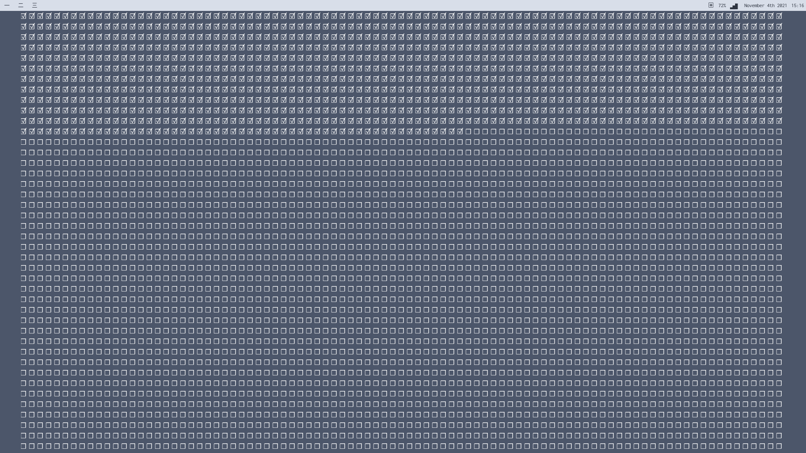

# cal-o-life-nwg-wrapper
Calendar of your life script for [nwg-wrapper](https://github.com/nwg-piotr/nwg-wrapper).

## Usage
1. Install nwg-wrapper
2. Place the script and stylesheet in `~/.config/nwg-wrapper/`
3. Edit the script's `birthday` value to mach your birthday
4. (OPTIONAL) Edit the maximum number of weeks for your life-expectancy. The current value however forms a nice-, equal-grid at 80.5 years.
5. Run `nwg-wrapper -s calolife.sh`

## Screenshot

